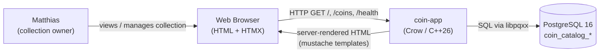
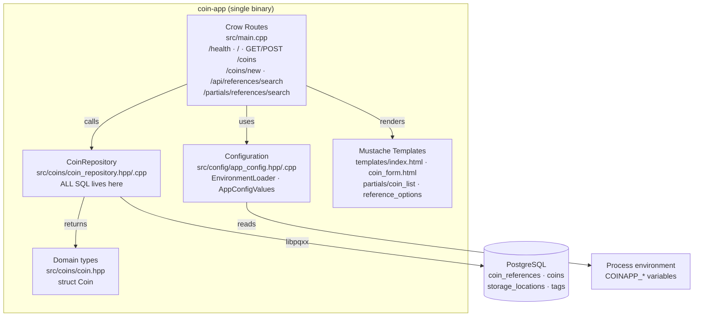
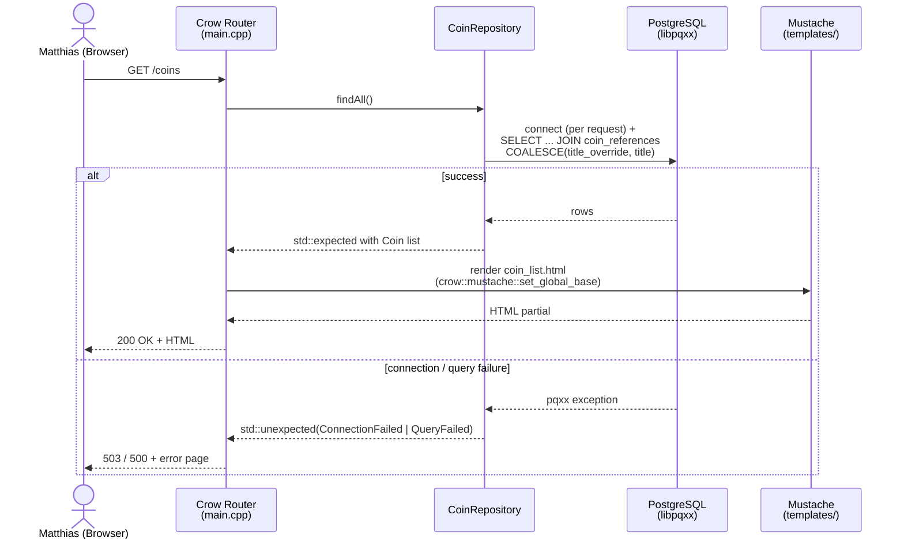
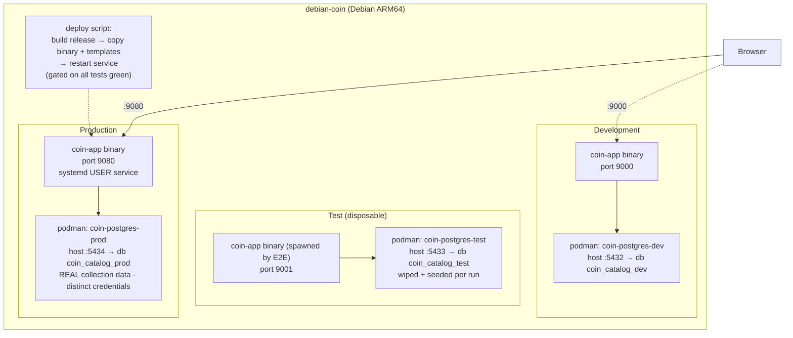

# coin-app — Architecture Documentation (arc42)

> Architecture documentation for **coin-app**, a personal coin collection management web application.
> Template: [arc42](https://arc42.org). Owner: Matthias (solo developer, learning project).

---

## 1. Introduction and Goals

coin-app is a hobby web application that lets Matthias maintain his personal coin collection through a clean web UI: browse the collection, view catalog details per coin, and (on the roadmap) add, edit, and delete entries. It is a **learning project** with a strong **Clean Code and Test-Driven Development (TDD)** philosophy: every feature is developed outside-in, starting from a failing end-to-end test, with implementation proceeding only until the test goes green.

### 1.1 Requirements Overview

| # | Requirement | Status |
|---|-------------|--------|
| R1 | Display the coin collection as an HTML list (title, country, year, metal) | Implemented |
| R2 | Health endpoint for monitoring (`/health`) | Implemented |
| R3 | Display all coin information in the web UI | Phase 1 |
| R4 | Styling with Pico.css | Phase 2 |
| R5 | Add-coin CRUD (form with type-ahead reference search, transactional insert) | Implemented |
| R6 | Edit / delete coins | Phase 4 |

### 1.2 Quality Goals

| Priority | Quality Goal | Scenario |
|----------|--------------|----------|
| 1 | **Testability** | Every feature is verifiable via automated unit, integration, and end-to-end tests that run against a real (disposable) database. |
| 2 | **Maintainability / Clean Code** | Routes stay thin, SQL lives in exactly one place (repository), domain objects cross layer boundaries. |
| 3 | **Deployability** | One statically configurable binary runs in all environments; deployment is a scripted, test-gated restart of a systemd user service. |
| 4 | **Simplicity** | Minimal dependency set, no ORM, no JavaScript framework — server-rendered HTML + HTMX. |

### 1.3 Stakeholders

| Role | Person | Expectation |
|------|--------|-------------|
| Owner / Developer / User | Matthias | A working tool for his own collection; a codebase that demonstrates and exercises Clean Code + TDD in modern C++. |

---

## 2. Architecture Constraints

| Constraint | Description |
|------------|-------------|
| **Language / toolchain** | C++26, compiled with GCC 14.2, built with CMake. |
| **Web framework** | Crow (header-only, ASIO-based) with mustache templates, serving HTML + HTMX. No separate frontend build. |
| **Database** | PostgreSQL 16, accessed via libpqxx. No ORM — hand-written SQL only. |
| **Test framework** | Catch2 for unit and integration tests; E2E tests use the `cpr` HTTP client against a spawned subprocess. |
| **Runtime host** | A single Debian ARM64 machine (`debian-coin`). |
| **Container runtime** | podman (rootless-style usage) — one container per PostgreSQL environment. |
| **Configuration** | Environment variables only (12-factor style); `.env` files per environment, gitignored. See ADR-0002. |
| **Process model** | Production app runs as a systemd **user** service — no root daemon, no system-wide install. |
| **Team size** | One developer; all operational procedures must be scriptable and low-ceremony. |

---

## 3. Context and Scope

### 3.1 Business Context

The system has exactly one human user (the owner) and one external system: the PostgreSQL database holding the collection data. There are no external APIs, no authentication domain, and no third-party integrations at this stage.

### 3.2 Technical Context

| Interface | Channel | Details |
|-----------|---------|---------|
| Browser ↔ coin-app | HTTP, plain (no TLS yet — see section 11) | Ports per environment: dev 9000, test 9001, prod 9080 (ADR-0005). |
| coin-app ↔ PostgreSQL | TCP, libpq (via libpqxx) | Containers published on host ports 5432/5433/5434 for dev/test/prod. |
| Operator → prod | systemd user service + deploy script | Build release, copy binary + templates, restart service; gated on all tests green. |

**Out of scope:** multi-user support, authentication/authorization, public exposure beyond the host machine, image storage for coins.

---

## 4. Solution Strategy

The architecture is deliberately minimal and follows a few strong decisions:

1. **Server-rendered monolith.** A single C++ binary built on Crow serves HTML directly using mustache templates, enhanced with HTMX for interactivity. No SPA, no API-first split — the simplest thing that serves the UI.
2. **Thin routes, one repository.** `main.cpp` contains only HTTP routing and view-model mapping. **All SQL** is encapsulated in `CoinRepository`, which returns plain domain objects (`Coin`) and error values — never exceptions and never pqxx types — to the routing layer (ADR-0003, ADR-0004).
3. **Environment-per-container isolation.** Dev, test, and prod each get their own podman PostgreSQL container with distinct ports, database names, and credentials; the test environment is disposable and re-seeded per run (ADR-0005). Configuration flows in exclusively via environment variables, so the *same binary* runs everywhere (ADR-0002).
4. **Outside-in TDD.** Each feature begins with a failing end-to-end test that spawns the real binary and makes real HTTP requests; unit and integration tests support the implementation inside the pyramid (ADR-0006).

These strategies directly serve the quality goals of testability, clean layering, and deployability while keeping the dependency surface tiny.

---

## 5. Building Block View

### 5.1 Level 1 — Whitebox coin-app

### 5.2 Level 2 — Building Blocks

| Building Block | Location | Responsibility |
|----------------|----------|----------------|
| **Crow routes** | `src/main.cpp` | Thin HTTP layer: `GET /health`, `GET /`, `GET /coins` (list), `POST /coins` (create, PRG 303 — ADR-0011), `GET /coins/new` (form), `GET /api/references/search` (JSON), `GET /partials/references/search` (HTMX fragment). Translates repository error categories to HTTP (ADR-0012). Contains **no SQL and no pqxx includes**. |
| **Configuration** | `src/config/app_config.hpp/.cpp` | `config::EnvironmentLoader` reads `COINAPP_DB_HOST/PORT/NAME/USER/PASSWORD` and `COINAPP_PORT`; `AppConfigValues` supplies defaults (typed, with safe int parsing) and an `explicit operator std::string` producing the libpqxx connection string. |
| **CoinRepository** | `src/coins/coin_repository.hpp/.cpp` | Encapsulates all persistence: `list_all()` (JOIN + COALESCE display query), `search_references()` (ILIKE type-ahead), `add_coin()` (single transaction: insert reference if new + insert collection item). Contract validation before DB access (`InvalidData`), real exceptions logged (`std::cerr`) and translated to error categories at the boundary (ADR-0012). |
| **Domain types** | `src/coins/coin.hpp` | `struct Coin` (full collection-item view, optionals mirror schema nullability), `struct ReferenceMatch` (type-ahead result), `struct NewCoinData` (add-coin contract: existing `reference_id` or complete `ref_*` triple). |
| **Error type** | `src/coins/coin_repository.hpp` | `enum class CoinRepositoryError { ConnectionFailed, InvalidData, QueryFailed }`, returned via `std::expected` (ADR-0004/ADR-0012). |
| **Templates** | `templates/` | `index.html` shell, `coin_form.html` (add-coin form, HTMX type-ahead), `partials/coin_list.html`, `partials/reference_options.html`; base path via `COINAPP_TEMPLATE_DIR` env override with compile-time fallback (ADR-0010). |
| **Schema / migrations** | `src/database/migrations/01_init.sql` | DDL for `coin_references` (catalog: title, country, `primary_metal` ENUM Gold/Silver/Copper/Platinum/Palladium/Other, composition, fineness, weights, diameter), `coins` (collection items: reference_id FK, storage_location_id FK, title_override, year, mint_mark, grade, quantity, purchase_price/currency/date, dealer, notes), `storage_locations`, `tags`, and `coin_tags` (many-to-many). |
| **Tests** | `tests/` | `test_db_config.cpp` (unit), `test_coin_repository.cpp` (integration vs. test DB), `e2e_tests.cpp` (spawns the real binary, `cpr` HTTP), shared fixtures `coin_fixtures.hpp`, env wrapper `run_with_env.sh` (ADR-0007). |

**Key structural rules** (enforced by convention and review): routes never include pqxx headers; SQL text appears only in `CoinRepository`; errors cross the repository boundary as values, not exceptions.

---

## 6. Runtime View

### 6.1 Scenario: Listing the coin collection (`GET /coins`)

### 6.2 Scenario: Outside-in feature cycle (TDD loop)

1. A new **E2E test** is written first: it spawns the real binary as a subprocess on the test port (9001) and issues real HTTP requests via `cpr` — initially **red**.
2. The test database container (`coin-postgres-test`) is wiped and seeded; integration fixtures use `TEST_`-tagged data with cleanup **before and after** each test.
3. Implementation proceeds (route → repository → template) until the E2E test is **green**; commit happens on green.
4. Deployment to prod is gated on the full suite being green (see section 7).

---

## 7. Deployment View

### 7.1 Environments

| Environment | App port | DB container | DB host port | Database | Data |
|-------------|----------|--------------|--------------|----------|------|
| Dev | 9000 | `coin-postgres-dev` | 5432 | `coin_catalog_dev` | Scratch / sample |
| Test | 9001 | `coin-postgres-test` | 5433 | `coin_catalog_test` | Disposable, seeded (`TEST_` fixtures) |
| Prod | 9080 | `coin-postgres-prod` | 5434 | `coin_catalog_prod` | **Real collection**, distinct credentials |

### 7.2 Deployment Process

- One binary for all environments; behavior is selected purely via environment variables from a per-environment `.env` file (gitignored) — ADR-0002 / ADR-0005.
- **Database containers are systemd-managed via Quadlet** (ADR-0008): one `.container` file per environment in `~/.config/containers/systemd/` on the host, `Restart=always`, started at boot via systemd linger. Manage with `systemctl --user status|restart coin-postgres-<env>`; logs via `journalctl --user -u ...`.
- Prod runs as a **systemd user service**; deployment = build release → copy binary + `templates/` → restart service, executed only when the full test suite is green.
- Schema changes are applied by running SQL from `src/database/migrations/` manually against the target database (no migration runner yet — see section 11).

---

## 8. Cross-cutting Concepts

### 8.1 Configuration (12-factor)

All runtime configuration arrives via environment variables, loaded once at startup by `EnvironmentLoader`: `COINAPP_DB_HOST`, `COINAPP_DB_PORT`, `COINAPP_DB_NAME`, `COINAPP_DB_USER`, `COINAPP_DB_PASSWORD`, and `COINAPP_PORT` (each with sensible defaults). There are no config files compiled into the binary and no per-environment builds. `.env` files live per environment and are gitignored (ADR-0002).

### 8.2 Error Handling

Errors are **values**, not exceptions, at architectural boundaries. `CoinRepository` returns `std::expected<std::vector<Coin>, CoinRepositoryError>`; pqxx exceptions are caught inside the repository and translated to `ConnectionFailed` or `QueryFailed`. Routes map these to HTTP 503 (connection) and 500 (query) (ADR-0004). Exceptions may still be used *within* a building block, but never cross it.

### 8.3 Persistence Pattern

Repository pattern (ADR-0003): `CoinRepository` is the single owner of SQL and of the pqxx dependency. Domain objects (`Coin`) are plain structs. The list query joins `coins` ↔ `coin_references` and resolves display titles with `COALESCE(title_override, title)`.

### 8.4 Testing Strategy (pyramid)

- **Unit tests** (Catch2): configuration parsing, defaults, connection-string building, domain logic — no I/O.
- **Integration tests** (Catch2): repository against the real test database in podman; `TEST_`-tagged fixtures, cleanup before **and** after each test.
- **End-to-end tests**: spawn the real binary as a subprocess on the test port, issue real HTTP requests with `cpr`, assert on status codes and HTML content. Every feature starts E2E-red (ADR-0006).

### 8.5 Templating

Server-side mustache via Crow. The template base directory is baked in at compile time (`COINAPP_TEMPLATE_DIR`) and applied with `crow::mustache::set_global_base`, because Crow's router resets `set_base` per request (documented gotcha — see ADR-0001 and section 11).

---

## 9. Architecture Decisions

All significant decisions are recorded as ADRs in `adr/`:

| ADR | Title | Decision in brief |
|-----|-------|-------------------|
| [ADR-0001](adr/0001-crow-as-web-framework.md) | Crow as web framework | Lightweight, header-only, ASIO-based, mustache built in. Trade-off: smaller community; some surprising behavior (route-level template base is reset per request). |
| [ADR-0002](adr/0002-config-via-environment-variables.md) | Configuration via environment variables only | 12-factor style; `EnvironmentLoader` + defaults; one binary for all environments; `.env` per environment, gitignored. |
| [ADR-0003](adr/0003-repository-pattern-for-db-access.md) | Repository pattern | `CoinRepository` encapsulates ALL SQL and returns domain objects; routes stay thin (no SQL, no pqxx include in `main.cpp`). |
| [ADR-0004](adr/0004-std-expected-for-error-handling.md) | Error handling with `std::expected` | pqxx exceptions are caught at the repository boundary and translated to `CoinRepositoryError` values; routes map them to HTTP 503/500. |
| [ADR-0005](adr/0005-environment-isolation-via-podman-containers.md) | Environment isolation via podman containers | Three containers (dev 5432 / test 5433 / prod 5434) with distinct DBs and credentials; test is disposable; prod runs as a systemd user service with test-gated deployment. |
| [ADR-0006](adr/0006-test-strategy-unit-integration-e2e.md) | Test strategy pyramid | Unit (Catch2) → integration (Catch2 vs. real test DB) → E2E (real binary subprocess + `cpr` HTTP); every feature starts with a failing E2E test, commit on green. |
| [ADR-0007](adr/0007-test-environment-via-wrapper-script.md) | Test environment via env-wrapper script | `tests/run_with_env.sh` sources the per-environment `.env` file and `exec`s the test binary; single source of truth for test env, no duplication in CMake. |
| [ADR-0008](adr/0008-container-lifecycle-via-quadlet.md) | Container lifecycle via Quadlet and systemd linger | Postgres containers run as systemd user services generated from Quadlet `.container` files; `Restart=always`; linger enabled for boot start without login. |
| [ADR-0009](adr/0009-purchase-price-required-fact.md) | Purchase price is a required fact | Plain `double`, never optional; 0.00 = gift or unknown (owner-accepted ambiguity); schema enforces `NOT NULL DEFAULT 0`. |
| [ADR-0010](adr/0010-prod-deployment-systemd-deploy-script.md) | Prod deployment via systemd + test-gated deploy script | Prod home `~/apps/coin-app/` separated from dev repo; systemd user service ordered after the DB; `scripts/deploy.sh` gates on the full test pyramid. |
| [ADR-0011](adr/0011-post-redirect-get.md) | Post/Redirect/Get for form submissions | Successful POSTs answer 303 to a GET route; errors render inline. E2E tests observe the raw 303 (`cpr::Redirect{false}`). |
| [ADR-0012](adr/0012-field-contract-and-error-taxonomy.md) | Field contract (`ref_*` vs bare) and error taxonomy | One naming convention across form/route/tests/struct; empty strings normalized to nullopt at the boundary; `ConnectionFailed`→503, `InvalidData`→400, `QueryFailed`→500; real exceptions logged to journald. |

---

## 10. Quality Requirements

### 10.1 Quality Scenarios

| ID | Quality | Scenario | Response / Measure |
|----|---------|----------|--------------------|
| QS-1 | Testability | A developer adds a feature | A failing E2E test exists *before* implementation; the full pyramid runs locally in minutes against disposable infrastructure. |
| QS-2 | Reliability | The database container is down when `/coins` is requested | Repository returns `ConnectionFailed`; the app responds **503** with a rendered error instead of crashing or hanging. |
| QS-3 | Reliability | A SQL error occurs (e.g., schema drift) | Repository returns `QueryFailed`; the app responds **500**; no exception escapes the repository boundary. |
| QS-4 | Deployability | Deploying a new release to prod | One script: build release → copy binary + templates → restart systemd user service; refuses to proceed unless all tests are green. |
| QS-5 | Portability | Running in a fresh environment | Clone repo, provide `.env` with `COINAPP_*` variables, start the matching podman DB container — no code or build changes. |
| QS-6 | Maintainability | Changing a query | SQL is edited in exactly one place (`CoinRepository`); routes and templates are untouched. |
| QS-7 | Availability | Host reboot | systemd user service restarts the prod app; `/health` returns 200 once the DB container is up. |

### 10.2 Quality Tree (summary)

- **Testability** (top goal): fast unit tests, real-DB integration tests, true black-box E2E tests.
- **Maintainability**: thin routes, single SQL owner, explicit error values.
- **Deployability**: single configurable binary, scripted test-gated release.
- **Simplicity**: five external dependencies total (Crow, libpqxx, Catch2, cpr, podman).

---

## 11. Risks and Technical Debt

| # | Item | Type | Consequence | Intended remedy |
|---|------|------|-------------|-----------------|
| 1 | **One DB connection per HTTP request** — no pooling | Technical debt | Latency per request; will not scale beyond personal use | Introduce a small connection pool when load or phases 3–4 require it. |
| 2 | **Migrations applied manually** — no migration runner | Technical debt | Schema drift risk between environments; error-prone releases | Adopt a migration runner (or a disciplined `migrations/` checksum script) before Phase 1 schema evolution. |
| 3 | **No HTTPS/TLS** | Risk | Credentials and collection data in cleartext on the wire | Acceptable on the single-host hobby setup; add TLS (reverse proxy or Crow SSL) before any exposure beyond localhost/LAN. |
| 4 | **Template path baked in at compile time** (`COINAPP_TEMPLATE_DIR`) + Crow resets `set_base` per request | Known gotcha / debt | Runtime template relocation requires recompilation; using the wrong Crow API silently breaks rendering | `crow::mustache::set_global_base` is the documented workaround (ADR-0001); revisit if Crow changes this behavior. |
| 5 | **No authentication** | Accepted risk | Anyone reaching the port can view (and later modify) the collection | Acceptable while bound to a private machine; auth must precede any CRUD exposure beyond the host. |
| 6 | **Single maintainer, framework community small** | Risk | Slower upstream fixes for Crow issues | Keep Crow usage surface small; document workarounds in ADRs. |

---

## 12. Glossary

| Term | Definition |
|------|------------|
| **ADR** | Architecture Decision Record — a short document capturing one significant decision and its rationale (see section 9). |
| **Catch2** | The C++ test framework used for unit and integration tests. |
| **Coin (domain object)** | `struct Coin { title, country, year:int, metal }` — the application's core currency between repository and routes. |
| **coin_references** | Catalog table: reference data for a coin type (title, country, `primary_metal` ENUM: Gold/Silver/Copper/Platinum/Palladium/Other, composition, fineness, weights, diameter). |
| **coins** | Collection table: items Matthias owns — FKs to `coin_references` and `storage_locations`, plus `title_override`, year, mint_mark, grade, quantity, purchase price/currency/date, dealer, notes. |
| **cpr** | "C++ Requests" — HTTP client library used by the E2E tests to make real HTTP calls against the spawned app. |
| **Crow** | Header-only C++ web framework (ASIO-based) providing routing and mustache templating. |
| **E2E test** | End-to-end test: spawns the real binary on the test port and asserts on HTTP status + HTML content. |
| **HTMX** | Small JS library enabling partial HTML swaps driven by server-rendered fragments — no SPA. |
| **libpqxx** | The official C++ client library for PostgreSQL (wraps libpq). |
| **mustache** | Logic-less template syntax used by Crow for server-side HTML rendering. |
| **podman** | Daemonless container engine used to run the three PostgreSQL environment containers. |
| **`std::expected`** | C++23 vocabulary type carrying either a value or an error — the project's boundary error mechanism (ADR-0004). |
| **systemd user service** | A systemd unit running under the user's session (no root) that keeps the prod app alive and starts it on login/boot. |
| **title_override** | Per-item title that takes precedence over the catalog title via `COALESCE(title_override, title)` in the list query. |
